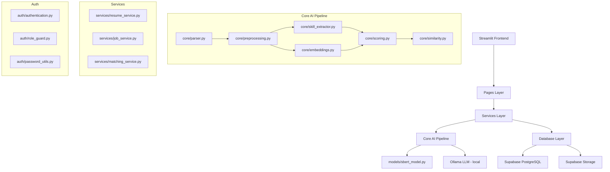
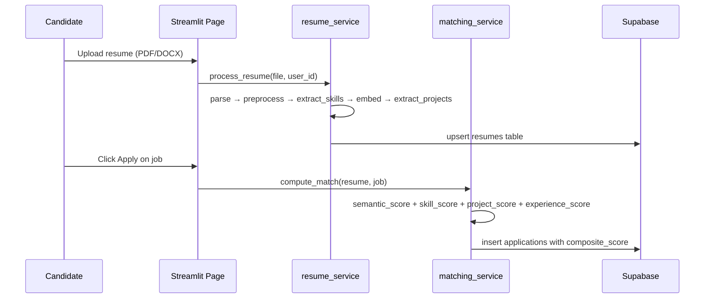

# Design Document: AI-Powered Resume Screening and Shortlisting System

## Overview

This system is a Streamlit-based web application that automates resume screening using local AI models. Candidates upload resumes; recruiters post jobs; the AI pipeline parses, embeds, scores, and ranks candidates against job descriptions using a composite ATS formula. Shortlisted candidates receive automated email notifications.

The system runs entirely with local models (sentence-transformers, Ollama) and a Supabase backend, requiring no external AI API calls for core functionality.

### Key Design Goals

- Composite ATS scoring: 40% semantic similarity + 30% skill match + 20% project score + 10% experience
- FAISS-accelerated vector search for scalable candidate ranking
- Hybrid project extraction: rule-based patterns + Ollama LLM fallback
- Dual-role UI: candidate (green theme) and recruiter (blue theme)
- Automated shortlist email via Gmail SMTP SSL

---

## Architecture



### Request Flow



---

## Components and Interfaces

### config.py

Central configuration module. All environment variables and tunable constants live here.

```python
# config.py
SUPABASE_URL: str          # from .env
SUPABASE_KEY: str          # from .env
EMAIL_ADDRESS: str         # from .env
EMAIL_PASSWORD: str        # from .env
OLLAMA_MODEL: str          # default: "llama3.2"
OLLAMA_BASE_URL: str       # default: "http://localhost:11434"
EMBEDDING_MODEL: str       # default: "all-MiniLM-L6-v2"
FAISS_INDEX_PATH: str      # default: "faiss_index.bin"

# ATS scoring weights
WEIGHT_SEMANTIC: float     # 0.40
WEIGHT_SKILL: float        # 0.30
WEIGHT_PROJECT: float      # 0.20
WEIGHT_EXPERIENCE: float   # 0.10

# Scoring thresholds
SHORTLIST_THRESHOLD: float # 0.65
MAX_EXPERIENCE_YEARS: int  # 20  (cap for normalization)
```

### core/preprocessing.py

Text normalization applied before embedding and extraction. Reduces noise from PDF/DOCX extraction artifacts.

```python
def clean_text(text: str) -> str:
    """Lowercase, strip extra whitespace, remove non-ASCII noise."""

def normalize_resume(text: str) -> str:
    """clean_text + section header normalization."""

def normalize_job_description(text: str) -> str:
    """clean_text + requirement bullet normalization."""
```

### services/resume_service.py

Orchestrates the full resume ingestion pipeline. Called by the Candidate Dashboard on upload.

```python
def process_resume(uploaded_file, user_id: str) -> dict:
    """
    1. parse_resume(file)          → raw text
    2. normalize_resume(text)      → clean text
    3. structured_extraction(text) → skills, email, phone, experience_years
    4. extract_projects(text)      → list of project dicts
    5. generate_embedding(text)    → 384-dim vector
    6. upsert to resumes table
    Returns: resume record dict
    """

def extract_projects(text: str) -> list[dict]:
    """
    Hybrid approach:
    1. Rule-based: regex for 'Projects', 'Personal Projects' section headers,
       extract bullet points beneath them.
    2. Ollama fallback: if rule-based yields < 1 project, call Ollama with
       prompt to extract project names and descriptions.
    Returns: [{"name": str, "description": str}, ...]
    """

def score_projects(resume_projects: list[dict], job_description: str) -> float:
    """
    For each project, embed description and compute cosine similarity to job embedding.
    Return mean similarity across all projects. Returns 0.0 if no projects found.
    """
```

### services/job_service.py

Handles job creation and retrieval for the Recruiter Dashboard.

```python
def create_job(recruiter_id: str, title: str, description: str, deadline: date) -> dict:
    """
    1. normalize_job_description(description)
    2. generate_embedding(description)
    3. extract_skills(description)
    4. insert into jobs table
    Returns: job record dict
    """

def get_active_jobs() -> list[dict]:
    """Return jobs where deadline > now()."""

def get_recruiter_jobs(recruiter_id: str) -> list[dict]:
    """Return all jobs for a given recruiter."""
```

### services/matching_service.py

Core ATS scoring engine. Computes composite scores and manages FAISS index for fast retrieval.

```python
def compute_match(resume: dict, job: dict) -> float:
    """
    Composite ATS score:
      score = 0.40 * semantic_score
            + 0.30 * skill_score
            + 0.20 * project_score
            + 0.10 * experience_score
    All sub-scores are in [0.0, 1.0].
    Returns float in [0.0, 1.0].
    """

def semantic_score(resume_embedding: list, job_embedding: list) -> float:
    """cosine_similarity(resume_embedding, job_embedding)"""

def skill_score(resume_skills: list[str], job_skills: list[str]) -> float:
    """
    Jaccard-style: |resume_skills ∩ job_skills| / |job_skills|
    Returns 0.0 if job_skills is empty.
    """

def experience_score(resume_years: int | None, job_description: str) -> float:
    """
    Extract required years from job description via regex.
    Normalize: min(resume_years / required_years, 1.0).
    Returns 0.5 if required years cannot be determined (neutral).
    """

def rank_candidates(job_id: str) -> list[dict]:
    """
    Fetch all applications for job_id, sort by composite_score descending.
    Returns list of {candidate_id, email, score, status}.
    """

def build_faiss_index(embeddings: list[list[float]]) -> faiss.IndexFlatIP:
    """
    Build an inner-product FAISS index from a list of 384-dim embeddings.
    Vectors are L2-normalized before insertion so IP == cosine similarity.
    """

def faiss_top_k(job_embedding: list[float], k: int = 20) -> list[int]:
    """
    Query FAISS index for top-k nearest resume embeddings.
    Returns list of resume row indices.
    Used by recruiter dashboard to pre-filter before full scoring.
    """
```

### auth/ (existing, no changes required)

| File | Functions | Notes |
|---|---|---|
| authentication.py | register_user(), login_user() | bcrypt hash via password_utils |
| password_utils.py | hash_password(), verify_password() | bcrypt |
| role_guard.py | require_login(), require_role() | Streamlit session guards |

### core/ (existing + new)

| File | Functions | Status |
|---|---|---|
| parser.py | extract_text_from_pdf(), extract_text_from_docx(), parse_resume() | Existing |
| preprocessing.py | clean_text(), normalize_resume(), normalize_job_description() | New |
| embeddings.py | generate_embedding() | Existing |
| similarity.py | cosine_similarity() | Existing |
| skill_extractor.py | extract_skills(), extract_email(), extract_phone(), extract_years_of_experience(), structured_extraction() | Existing |
| scoring.py | final_score() → updated to 4-component formula | Update weights |
| email_service.py | send_shortlist_email() | Existing |

### pages/ (existing, minor updates)

- `3_Candidate_Dashboard.py`: call `resume_service.process_resume()` instead of inline logic; pass project score to `final_score()`
- `4_Recruiter_Dashboard.py`: call `matching_service.rank_candidates()` for sorted display; add "Send Shortlist Email" button trigger

---

## Data Models

### Database Schema (Supabase PostgreSQL)

```sql
-- Users table
CREATE TABLE users (
    id          UUID PRIMARY KEY DEFAULT gen_random_uuid(),
    email       TEXT UNIQUE NOT NULL,
    password    TEXT NOT NULL,           -- bcrypt hash
    role        TEXT NOT NULL CHECK (role IN ('candidate', 'recruiter')),
    created_at  TIMESTAMPTZ DEFAULT now()
);

-- Resumes table
CREATE TABLE resumes (
    id               UUID PRIMARY KEY DEFAULT gen_random_uuid(),
    user_id          UUID REFERENCES users(id) ON DELETE CASCADE,
    extracted_text   TEXT,
    embedding        VECTOR(384),        -- pgvector, all-MiniLM-L6-v2 output
    file_name        TEXT,
    file_path        TEXT,               -- Supabase Storage path
    skills           TEXT[],             -- extracted skill list
    experience_years INT,
    projects         JSONB,              -- [{"name": str, "description": str}]
    uploaded_at      TIMESTAMPTZ DEFAULT now(),
    UNIQUE(user_id)
);

-- Jobs table
CREATE TABLE jobs (
    id            UUID PRIMARY KEY DEFAULT gen_random_uuid(),
    recruiter_id  UUID REFERENCES users(id) ON DELETE CASCADE,
    title         TEXT NOT NULL,
    description   TEXT NOT NULL,
    embedding     VECTOR(384),
    skills        TEXT[],
    deadline      DATE NOT NULL,
    created_at    TIMESTAMPTZ DEFAULT now()
);

-- Applications table
CREATE TABLE applications (
    id                UUID PRIMARY KEY DEFAULT gen_random_uuid(),
    candidate_id      UUID REFERENCES users(id) ON DELETE CASCADE,
    job_id            UUID REFERENCES jobs(id) ON DELETE CASCADE,
    similarity_score  FLOAT NOT NULL,    -- composite ATS score [0,1]
    semantic_score    FLOAT,
    skill_score       FLOAT,
    project_score     FLOAT,
    experience_score  FLOAT,
    status            TEXT DEFAULT 'applied' CHECK (status IN ('applied', 'shortlisted', 'rejected')),
    applied_at        TIMESTAMPTZ DEFAULT now(),
    UNIQUE(candidate_id, job_id)
);
```

### In-Memory / File Models

```python
# Resume record (returned by resume_service.process_resume)
ResumeRecord = {
    "user_id": str,
    "extracted_text": str,
    "embedding": list[float],       # 384-dim
    "skills": list[str],
    "experience_years": int | None,
    "projects": list[dict],         # [{"name": str, "description": str}]
    "file_name": str,
    "file_path": str,
}

# Match result (returned by matching_service.compute_match)
MatchResult = {
    "composite_score": float,
    "semantic_score": float,
    "skill_score": float,
    "project_score": float,
    "experience_score": float,
}
```

### FAISS Index

- Type: `faiss.IndexFlatIP` (inner product, equivalent to cosine after L2 normalization)
- Dimension: 384 (all-MiniLM-L6-v2 output size)
- Persistence: serialized to `FAISS_INDEX_PATH` (configurable in config.py)
- Rebuild trigger: on each new resume upload or on-demand via recruiter dashboard
- Usage: pre-filter top-k candidates before full composite scoring to reduce DB load

---

## Correctness Properties

*A property is a characteristic or behavior that should hold true across all valid executions of a system — essentially, a formal statement about what the system should do. Properties serve as the bridge between human-readable specifications and machine-verifiable correctness guarantees.*

### Property 1: Resume parsing round-trip

*For any* PDF or DOCX file generated from a known text string, parsing that file with `parse_resume()` should return text that contains all the original non-whitespace tokens from the source text.

**Validates: Requirements 1.1**

---

### Property 2: Skill extraction completeness

*For any* resume text that contains one or more skills from `SKILL_LIST`, `extract_skills()` should return a list that includes every skill present in the text (case-insensitive match).

**Validates: Requirements 1.2**

---

### Property 3: Embedding dimension invariant

*For any* non-empty text string, `generate_embedding()` should return a list of exactly 384 floats, regardless of text length or content.

**Validates: Requirements 1.3, 2.2**

---

### Property 4: Resume upsert idempotence

*For any* user, uploading a resume twice (same or different file) should result in exactly one record in the `resumes` table for that user — the second upload replaces the first rather than creating a duplicate.

**Validates: Requirements 1.4, 1.5**

---

### Property 5: Composite ATS score formula correctness

*For any* combination of semantic score, skill score, project score, and experience score (all in [0.0, 1.0]), `compute_match()` should return exactly `0.40 * semantic + 0.30 * skill + 0.20 * project + 0.10 * experience`, and the result should always be in [0.0, 1.0].

**Validates: Requirements 3.1**

---

### Property 6: Skill score ratio correctness

*For any* non-empty job skill list and resume skill list, `skill_score()` should return `|resume_skills ∩ job_skills| / |job_skills|`, a value in [0.0, 1.0]. When job skills is empty, the score should be 0.0.

**Validates: Requirements 3.3**

---

### Property 7: Experience score normalization

*For any* resume with `experience_years` ≥ 0 and a job description specifying required years > 0, `experience_score()` should return `min(resume_years / required_years, 1.0)`. The score should never exceed 1.0 regardless of how many years the candidate has.

**Validates: Requirements 3.6**

---

### Property 8: Candidate ranking is sorted descending

*For any* list of applications with composite scores, `rank_candidates()` should return them ordered by `composite_score` descending — i.e., for every adjacent pair (a, b) in the result, `a.score >= b.score`.

**Validates: Requirements 4.1, 4.3**

---

### Property 9: FAISS top-k matches brute-force cosine

*For any* set of resume embeddings and a job embedding, the top-k indices returned by `faiss_top_k()` should match the top-k indices returned by sorting all cosine similarities computed with `cosine_similarity()` — i.e., FAISS produces the same ranking as brute-force for normalized vectors.

**Validates: Requirements 4.2**

---

### Property 10: Password hashing is non-reversible

*For any* plaintext password, `hash_password()` should return a value that is not equal to the plaintext, and `verify_password(plaintext, hash_password(plaintext))` should return True while `verify_password(wrong_password, hash_password(plaintext))` should return False for any `wrong_password ≠ plaintext`.

**Validates: Requirements 6.1, 6.2, 6.3**

---

### Property 11: Shortlist email contains job title

*For any* job title string, the email body produced by `send_shortlist_email()` should contain that exact job title string.

**Validates: Requirements 5.3**

---

### Property 12: Expired jobs excluded from active listing

*For any* set of jobs with mixed past and future deadlines, `get_active_jobs()` should return only jobs where `deadline > current_date`. No job with a past deadline should appear in the result.

**Validates: Requirements 2.3**

---

## Error Handling

### Resume Parsing Errors

- `parse_resume()` returns `None` for unsupported file types; callers must check before proceeding
- PDF extraction failures (corrupted file, password-protected) are caught and logged; user sees a friendly error message
- Empty extracted text triggers a warning — the resume is not stored and the user is prompted to re-upload

### Embedding Errors

- If the SBERT model fails to load (missing model files), the app raises a clear startup error rather than failing silently at runtime
- `generate_embedding()` raises `ValueError` if input text is empty or None

### Scoring Errors

- `compute_match()` returns 0.0 if either embedding is None (defensive fallback matching existing `cosine_similarity` behavior)
- `experience_score()` returns 0.5 (neutral) when required years cannot be parsed from the job description
- `score_projects()` returns 0.0 when the projects list is empty (requirement 3.5 edge case)

### Ollama / LLM Errors

- If Ollama is not running or times out, `extract_projects()` falls back to rule-based extraction only and logs a warning
- Ollama responses that cannot be parsed as JSON are discarded; rule-based results are used instead

### FAISS Index Errors

- If the FAISS index file does not exist on startup, `faiss_top_k()` falls back to full table scan via Supabase
- Index rebuild failures are logged but do not block the application

### Database Errors

- Supabase client errors are caught at the service layer and re-raised as application-level exceptions with user-friendly messages
- Duplicate application attempts (same candidate + job) are caught via the UNIQUE constraint and shown as "Already applied"

### Email Errors

- SMTP failures in `send_shortlist_email()` are caught and logged; the shortlist status update is not rolled back (email is best-effort)
- Missing `EMAIL_ADDRESS` or `EMAIL_PASSWORD` env vars cause a startup warning; shortlisting still works but email is skipped

### Authentication Errors

- `login_user()` returns `None` for both "user not found" and "wrong password" cases (no information leakage about which failed)
- Role guard redirects to login page rather than showing an error for unauthorized access

---

## Testing Strategy

### Dual Testing Approach

Both unit tests and property-based tests are required. They are complementary:

- Unit tests catch concrete bugs with specific known inputs and verify integration points
- Property-based tests verify universal correctness across thousands of generated inputs

### Property-Based Testing

**Library**: `hypothesis` (Python)

**Configuration**: Each property test runs a minimum of 100 examples (`@settings(max_examples=100)`).

Each property test must be tagged with a comment referencing the design property:

```python
# Feature: ai-resume-screening, Property 5: Composite ATS score formula correctness
@settings(max_examples=100)
@given(
    semantic=st.floats(0.0, 1.0),
    skill=st.floats(0.0, 1.0),
    project=st.floats(0.0, 1.0),
    experience=st.floats(0.0, 1.0),
)
def test_composite_score_formula(semantic, skill, project, experience):
    result = compute_match_from_scores(semantic, skill, project, experience)
    expected = 0.40 * semantic + 0.30 * skill + 0.20 * project + 0.10 * experience
    assert abs(result - expected) < 1e-9
    assert 0.0 <= result <= 1.0
```

**Property tests to implement** (one test per property):

| Test | Property | File |
|---|---|---|
| test_embedding_dimension | Property 3 | tests/test_embeddings.py |
| test_resume_upsert_idempotence | Property 4 | tests/test_resume_service.py |
| test_composite_score_formula | Property 5 | tests/test_matching.py |
| test_skill_score_ratio | Property 6 | tests/test_matching.py |
| test_experience_score_normalization | Property 7 | tests/test_matching.py |
| test_ranking_sorted_descending | Property 8 | tests/test_matching.py |
| test_faiss_matches_brute_force | Property 9 | tests/test_matching.py |
| test_password_hashing | Property 10 | tests/test_auth.py |
| test_shortlist_email_contains_title | Property 11 | tests/test_email.py |
| test_expired_jobs_excluded | Property 12 | tests/test_job_service.py |

### Unit Tests

Unit tests focus on specific examples, edge cases, and integration points. Avoid duplicating what property tests already cover.

**tests/test_parsing.py**:
- Example: parse a known PDF and verify specific text is extracted (Property 1 example)
- Edge case: empty PDF returns empty string, not None
- Edge case: DOCX with only whitespace paragraphs

**tests/test_matching.py**:
- Edge case: `skill_score` with empty job skills returns 0.0
- Edge case: `experience_score` with None resume years returns 0.5
- Edge case: `score_projects` with empty projects list returns 0.0
- Example: identical resume and job embeddings yield semantic_score of 1.0

**tests/test_resume_service.py**:
- Example: `extract_projects` with a resume containing a "Projects" section header
- Edge case: `extract_projects` with no project section falls back to Ollama (mocked)

**tests/test_auth.py**:
- Example: register then login with correct credentials succeeds
- Example: login with wrong password returns None

### Test File Structure

```
tests/
  test_parsing.py        # parser + preprocessing
  test_matching.py       # scoring, FAISS, ranking (property + unit)
  test_resume_service.py # resume pipeline, project extraction
  test_job_service.py    # job creation, active job filtering
  test_auth.py           # password hashing, login/register
  test_email.py          # email content properties
  test_embeddings.py     # embedding dimension invariant
```
